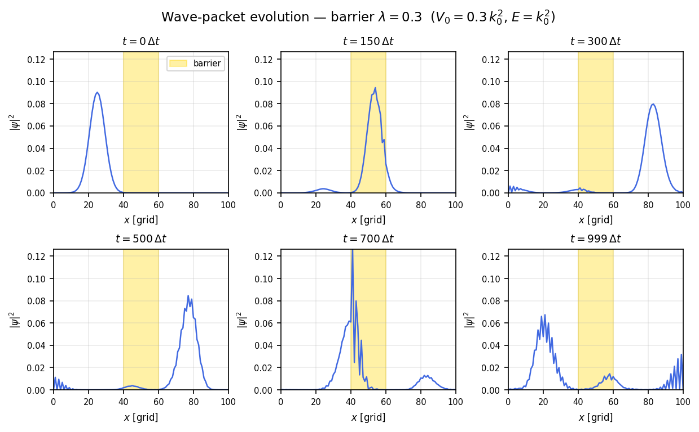
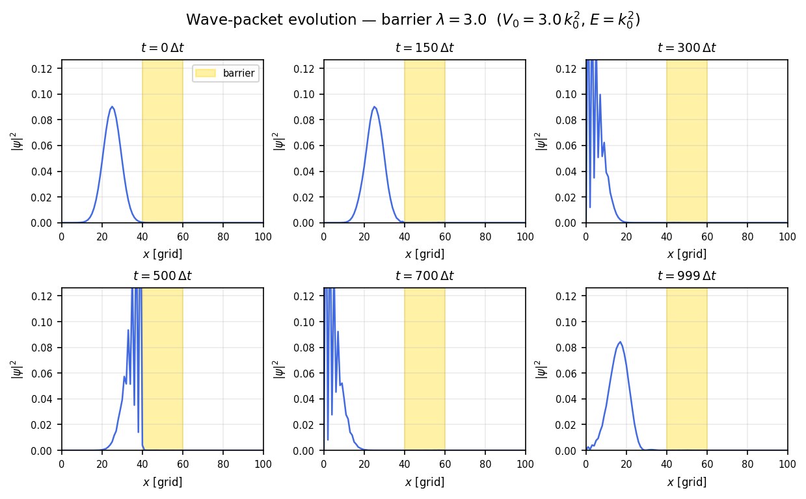
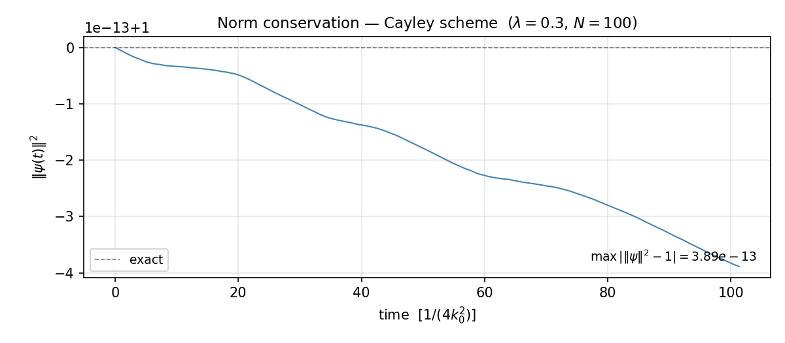
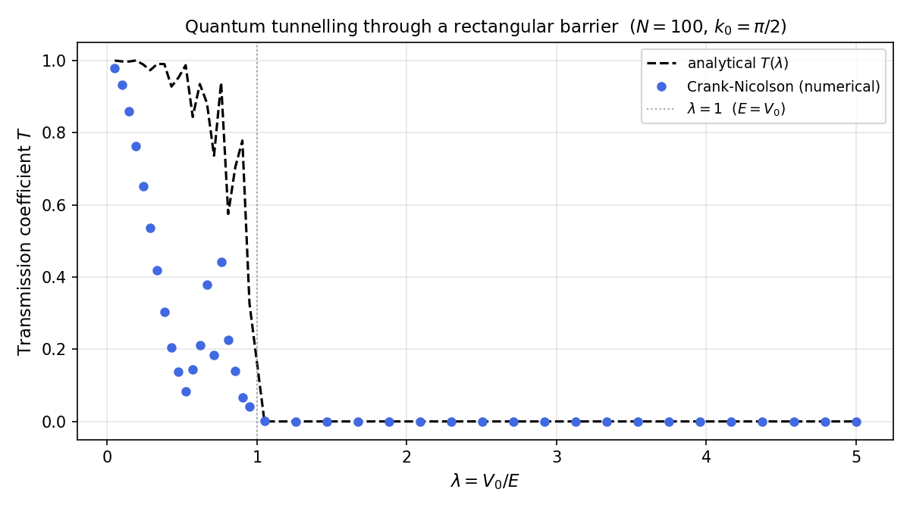
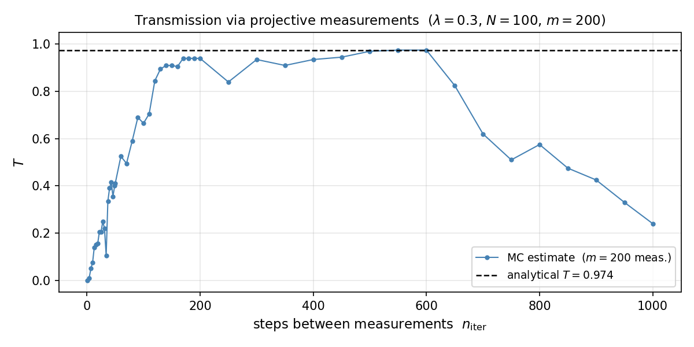

# Crank-Nicolson solution of the time-dependent Schrödinger equation

Python implementation of the **Cayley (Crank-Nicolson)** integrator for the 1D time-dependent Schrödinger equation, applied to a Gaussian wave packet scattering off a rectangular potential barrier.  Includes a Monte Carlo quantum-measurement simulation of the transmission coefficient.

---

## Repository layout

```
├── schrodinger/
│   ├── solver.py               # Cayley (Crank-Nicolson) integrator — Thomas algorithm
│   ├── initial_conditions.py   # Gaussian wave packet, rectangular barrier, analytical T(λ)
│   └── reflection.py           # Monte Carlo projective-measurement simulation
├── scripts/
│   ├── run_wavepacket.py       # Wave-packet evolution → 3 figures
│   └── run_reflection.py       # Transmission coefficient study → 2 figures
└── figures/                    # All PNG outputs (generated by the scripts)
```

---

## Physics

### Time-dependent Schrödinger equation

$$
i\,\frac{\partial\psi}{\partial t} = H\psi, \qquad H = -\frac{\partial^2}{\partial x^2} + V(x)
$$

in units $\hbar = 1$, $2m = 1$, so the energy of a plane wave $e^{ik_0 x}$ is $E = k_0^2$.

**Grid:** $N+1$ points ($j = 0\ldots N$, $\Delta x = 1$), Dirichlet BCs $\psi(0) = \psi(N) = 0$.

**Initial state:** normalised Gaussian wave packet

$$
\psi(x, 0) \propto e^{ik_0 x}\,\exp\!\left[-\frac{(x - x_0)^2}{2\sigma^2}\right], \qquad x_0 = \frac{N}{4},\quad \sigma = \frac{N}{16}
$$

**Barrier:** $V(x) = \lambda k_0^2$ for $x \in \left[\tfrac{2N}{5},\,\tfrac{3N}{5}\right]$, zero elsewhere.  
The ratio $\lambda = V_0/E$ controls the regime: $\lambda < 1$ above-barrier; $\lambda > 1$ tunnelling.

### Cayley (Crank-Nicolson) scheme

The Cayley propagator

$$
U = \frac{1 - i H\,\Delta t/2}{1 + i H\,\Delta t/2}
$$

is **unitary by construction** — the norm $\|\psi\|^2$ is conserved to machine precision at every step. Setting $\chi = \psi^{n+1} + \psi^n$ the implicit system reduces to the **tridiagonal** equation

$$
\chi_{j-1} + \underbrace{\left[(-2 - V_j) + \frac{2i}{s}\right]}_{d_j}\chi_j + \chi_{j+1} = \frac{4i}{s}\,\psi^n_j, \qquad s = \frac{1}{4k_0^2}
$$

solved in $O(N)$ per step via the **Thomas algorithm** (precomputing the $\alpha_j$ coefficients once). The time step is $\Delta t = s = 1/(4k_0^2)$.

### Exact transmission coefficient

For a rectangular barrier of width $L = N/5$:

$$
T(\lambda) = \begin{cases}
\displaystyle\frac{1}{1 + \dfrac{\lambda^2\sin^2(\kappa L)}{4(1-\lambda)}},
& \lambda < 1, \quad \kappa = k_0\sqrt{1-\lambda} \\[10pt]
\displaystyle\frac{1}{1 + \dfrac{\lambda^2\sinh^2(\kappa' L)}{4(\lambda-1)}},
& \lambda > 1, \quad \kappa' = k_0\sqrt{\lambda-1}
\end{cases}
$$

### Monte Carlo quantum measurement

At every $n_{\rm iter}$ time steps a **projective measurement** is performed: the probability of finding the particle on the right half-space ($x \geq 2N/5$) is $P_R = \sum_{j\geq j_R}|\psi_j|^2$.

- With probability $P_R$: particle detected as *transmitted* — reinitialise $\psi_0$.
- Otherwise: collapse onto the left ($\psi = 0$ for $j \geq j_R$), renormalise, continue.

After $m$ measurements, $T_{\rm MC} = N_T / m$.

---

## Results

### Wave-packet evolution

#### Low barrier — $\lambda = 0.3$  (above-barrier, $T_{\rm exact} \approx 0.97$)



The wave packet scatters off the barrier (gold band): most of the probability transmits; a small reflected component travels back to the left.

#### High barrier — $\lambda = 3.0$  (tunnelling regime, $T_{\rm exact} \approx 10^{-3}$)



The packet is almost entirely reflected; only an exponentially small fraction tunnels through.

#### Norm conservation



The Cayley scheme conserves $\|\psi\|^2$ to better than $10^{-14}$ over 1 000 steps — numerical evidence of exact unitarity.

---

### Transmission coefficient

#### $T(\lambda)$ — numerical vs analytical



The Crank-Nicolson result (filled circles) matches the exact quantum-mechanical formula (dashed) across both the above-barrier and tunnelling regimes.  Resonances ($T = 1$) appear when an integer number of half-wavelengths fits inside the barrier.

#### $T$ vs measurement interval (Monte Carlo)



For very short intervals ($n_{\rm iter} \ll 1$) the Zeno effect suppresses transmission: frequent measurements prevent the wave packet from reaching the barrier. As $n_{\rm iter}$ increases the estimate converges to the unperturbed value $T_{\rm exact}$.

---

## Usage

```bash
pip install numpy numba matplotlib scipy
```

```bash
python scripts/run_wavepacket.py
python scripts/run_reflection.py
```

Both scripts write output to `figures/` and print a summary to stdout.

> **Numba JIT compilation**: the first run compiles the hot loops (~5–15 s). Subsequent runs use the cached bytecode and are significantly faster.
